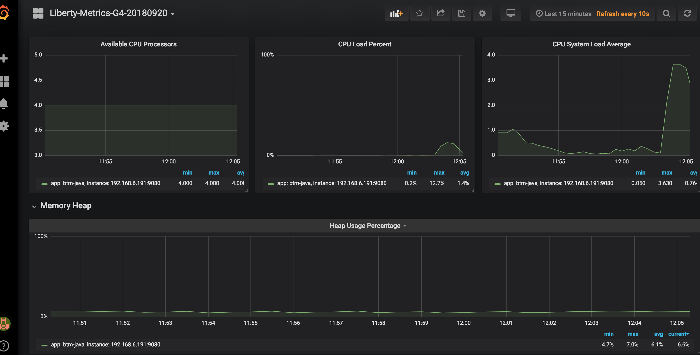

### Deploy a local Prometheus and Grafana stack with Docker Compose

During this lab we will run the Prometheus and Grafana in  Docker Compose.
Configuration for this lab is based on [https://github.com/vegasbrianc/prometheus](https://github.com/vegasbrianc/prometheus).
In the lab VM the Prometheus docker compose project was cloned to `/root/prometheus`.

1). Add scraping job definition to the Prometheus configuration file `prometheus/prometheus/prometheus.yml` by adding (uncommenting in the lab VM) the following code within `scrape_config` section:

```
  - job_name: 'btm-java'
    scrape_interval: 20s
    static_configs:
    - targets: ['xxx.xxx.xxx.xxx:9080']
      labels:
        app: 'b2m-java'
        group: 'production'

```
replace xxx.xxx.xxx.xxx with your own host machine's IP. In the Skytap lab VM, the IP address should be `10.0.0.1`.

2). Start Prometheus & Grafana stack:
   
```
cd ~/prometheus
docker-compose down
docker-compose up -d
```
Expected output:
```
Creating network "prometheus_back-tier" with the default driver
Creating network "prometheus_front-tier" with the default driver
Creating prometheus_cadvisor_1      ... done
Creating prometheus_alertmanager_1  ... done
Creating prometheus_node-exporter_1 ... done
Creating prometheus_prometheus_1    ... done
Creating prometheus_grafana_1       ... done

```

Verify that Prometheus started via: [http://localhost:9090](http://localhost:9090/graph)


## Set the Prometheus datasource in Grafana

Logon to Grafana via `http://localhost:3000`
- user: admin
- password: foobar
  
Verify the prometheus datasource configuration in Grafana. If it was not already configured, [create](http://docs.grafana.org/features/datasources/prometheus/#adding-the-data-source-to-grafana) a Grafana datasource with this settings:

+ name: Prometheus
+ type: prometheus
+ url: http://localhost:9090
+ access: browser


## Configure dashboard

Grafana Dashboard to [import](http://docs.grafana.org/reference/export_import/#importing-a-dashboard): `~/b2m-java/ibm-open-liberty-grafana-dashboard.json`

Generate application traffic using provided script:

```
cd ~/b2m-java
./load_test.sh
```

Expected views:
CPU & Memory utilization for Liberty Profile:


Servlet requests volume and response time:
